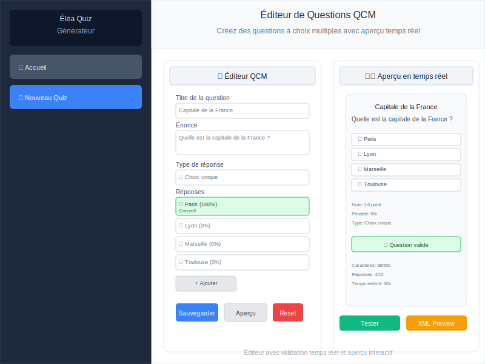
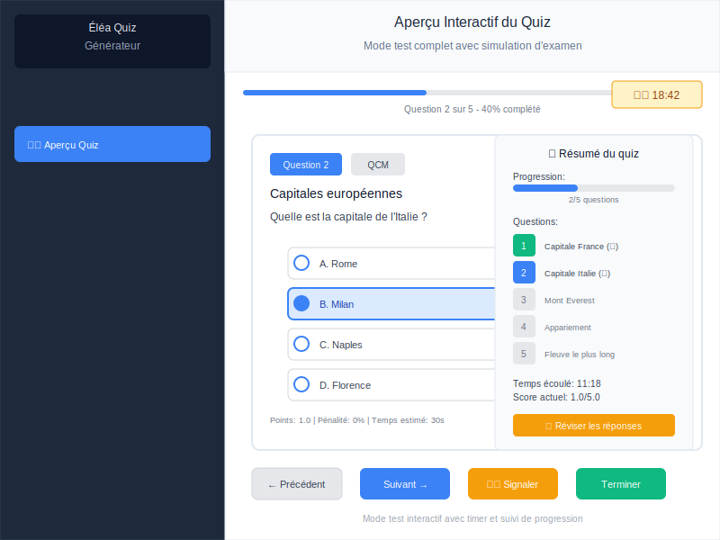

# Éléa Quiz Générateur 🎯

[](https://opensource.org/licenses/MIT)
[](https://github.com/ggaillard/elea-quiz-generateur/stargazers)
[](https://github.com/ggaillard/elea-quiz-generateur/network)
[](https://github.com/ggaillard/elea-quiz-generateur/issues)
[](https://github.com/ggaillard/elea-quiz-generateur)
[](https://reactjs.org/)
[](https://www.typescriptlang.org/)
[](https://vitejs.dev/)

Un générateur de QCM moderne et intuitif pour créer des quiz compatibles avec Moodle et Éléa. Cette application web permet de créer, éditer et exporter des quiz avec une interface utilisateur moderne et responsive.

## 📸 Aperçu Visuel

> **📋 Documentation Complète** : Consultez le [Guide Visuel](VISUAL_GUIDE.md) pour une présentation détaillée avec captures d'écran de toutes les fonctionnalités.

### Interface Principale

*Interface moderne avec sidebar de navigation et zone de travail principale*

### Éditeur de Questions

*Éditeur intuitif avec aperçu en temps réel et validation instantanée*

### Aperçu Interactif

*Mode test complet avec simulation d'examen et résultats*

### Design Responsive

*Interface mobile optimisée avec navigation tactile intuitive*

**📱 Compatibilité** : L'application s'adapte parfaitement aux mobiles, tablettes et ordinateurs de bureau.

## ✨ Fonctionnalités

### 🎨 Interface Moderne
- **Design responsive** adapté mobile et desktop
- **Interface intuitive** avec navigation fluide
- **Thème moderne** avec Tailwind CSS
- **Icônes Lucide** pour une meilleure UX

### 📝 Types de Questions
- **QCM** (choix multiples) - simple ou multiple
- **Vrai/Faux** avec feedbacks personnalisés
- **Réponse courte** avec plusieurs variantes acceptées
- **Appariement** pour associer des éléments

### 🔧 Fonctionnalités Avancées
- **Gestion des questions** avec recherche et filtres
- **Validation temps réel** des données saisies
- **Aperçu interactif** des questions et quiz
- **Duplication** de questions
- **Système de tags** pour organiser les questions

### 💾 Stockage et Export
- **Sauvegarde automatique** dans localStorage
- **Export XML Moodle** strictement conforme
- **Export/Import CSV** avec template fourni
- **Backup/Restore** des données

### 🌐 Compatibilité
- **Moodle** (format XML natif)
- **Éléa** (plateforme éducative)
- **Navigateurs modernes** (Chrome, Firefox, Safari, Edge)

## 🚀 Installation

### Prérequis
- Node.js 18+ 
- npm ou yarn

### Installation rapide
```bash
# Cloner le repository
git clone https://github.com/votre-username/elea-quiz-generateur.git
cd elea-quiz-generateur

# Installer les dépendances
npm install

# Démarrer le serveur de développement
npm run dev
```

### Construction pour production
```bash
# Construire l'application
npm run build

# Prévisualiser la build
npm run preview
```

## 📁 Structure du Projet

```
src/
├── components/               # Composants React
│   ├── QuizBuilder.tsx      # Composant principal
│   ├── QuestionEditor.tsx   # Éditeur de questions
│   ├── QuestionPreview.tsx  # Aperçu des questions
│   ├── QuizPreview.tsx      # Aperçu interactif du quiz
│   ├── ExportPanel.tsx      # Panel d'export
│   ├── ImportPanel.tsx      # Panel d'import
│   ├── DragDropQuestionList.tsx # Liste avec recherche/filtres
│   └── ...
├── contexts/                # Contextes React
│   └── QuizContext.tsx      # Gestion de l'état global
├── services/                # Services métier
│   ├── storage.ts           # Stockage localStorage
│   ├── xmlGenerator.ts      # Génération XML Moodle
│   └── csvParser.ts         # Import/Export CSV
├── types/                   # Types TypeScript
│   └── index.ts            # Définitions des types
├── utils/                   # Utilitaires
│   └── index.ts            # Fonctions utilitaires
└── data/                    # Données et templates
    ├── template_questions.csv
    └── csv_template_guide.md
```

## 🎯 Utilisation

### Créer un nouveau quiz
1. Cliquez sur "Nouveau Quiz" dans la sidebar
2. Renseignez le nom et la description
3. Commencez à ajouter des questions

### Ajouter des questions
1. Cliquez sur "Ajouter une question"
2. Choisissez le type de question
3. Remplissez le contenu et les réponses
4. Sauvegardez

### Gérer les questions
- **Recherche** : Utilisez la barre de recherche pour trouver des questions
- **Filtres** : Filtrez par type de question
- **Tri** : Triez par nom, type ou date de création
- **Aperçu** : Prévisualisez les questions avant publication

### Exporter un quiz
1. Sélectionnez votre quiz
2. Cliquez sur "Export" dans la sidebar
3. Choisissez le format (XML Moodle ou CSV)
4. Configurez les options d'export
5. Téléchargez le fichier

### Importer des questions
1. Cliquez sur "Import" dans la sidebar
2. Sélectionnez le format (CSV ou XML)
3. Choisissez votre fichier
4. Prévisualisez les données
5. Importez les questions

### Tester un quiz
1. Sélectionnez un quiz avec des questions
2. Cliquez sur "Aperçu" pour tester interactivement
3. Répondez aux questions
4. Consultez vos résultats

## 📊 Format CSV

Le format CSV permet d'importer en masse des questions. Utilisez le template fourni dans `src/data/template_questions.csv`.

### Colonnes du CSV
- **Type**: mcq, truefalse, shortanswer, matching
- **Titre**: Titre de la question
- **Question**: Texte de la question
- **Note**: Note par défaut (généralement 1)
- **Pénalité**: Pénalité en cas d'erreur (généralement 0)
- **Feedback général**: Feedback affiché après la réponse
- **Tags**: Tags séparés par des virgules
- **Réponse 1-5**: Textes des réponses
- **Fraction 1-5**: Pourcentages de points (0-100)
- **Feedback 1-5**: Feedbacks spécifiques
- **Options spéciales**: Options additionnelles

### Exemple de ligne CSV
```csv
mcq,Capitale France,Quelle est la capitale de la France ?,1,0,Paris est la capitale.,géographie,Paris,100,Correct !,Lyon,0,Incorrect.,Marseille,0,Incorrect.,Toulouse,0,Incorrect.,,,,
```

## 🔧 Technologies Utilisées

- **React 18** - Framework JavaScript
- **TypeScript** - Typage statique
- **Tailwind CSS** - Framework CSS
- **Lucide Icons** - Icônes
- **Vite** - Build tool
- **PapaParse** - Parser CSV
- **LocalStorage** - Stockage local

## 🎨 Personnalisation

### Variables d'environnement
```env
VITE_APP_NAME=Éléa Quiz Générateur
VITE_APP_VERSION=1.0.0
```

### Personnalisation du thème
Modifiez `tailwind.config.js` pour personnaliser les couleurs et styles :

```javascript
module.exports = {
  theme: {
    extend: {
      colors: {
        primary: {
          50: '#f0f9ff',
          500: '#3b82f6',
          600: '#2563eb',
        }
      }
    }
  }
}
```

## 🧪 Tests et Validation

### Tests de fonctionnalités
- ✅ Création de quiz
- ✅ Ajout/édition/suppression de questions
- ✅ Export XML Moodle
- ✅ Import/Export CSV
- ✅ Stockage local
- ✅ Aperçu interactif
- ✅ Validation temps réel

### Tests de performance
- ✅ Support de >1000 questions
- ✅ Recherche et filtrage rapide
- ✅ Sauvegarde optimisée

## 📦 Build et Déploiement

### Build locale
```bash
npm run build
```

### Déploiement sur Netlify
```bash
# Installer la CLI Netlify
npm install -g netlify-cli

# Déployer
netlify deploy --dir=dist --prod
```

### Déploiement sur Vercel
```bash
# Installer la CLI Vercel
npm install -g vercel

# Déployer
vercel --prod
```

## 📸 Documentation Visuelle

### Captures d'Écran Disponibles
L'application est entièrement documentée avec des captures d'écran détaillées :

- **Interface Principale** : Écran d'accueil, navigation, création de quiz
- **Éditeurs de Questions** : QCM, Vrai/Faux, Réponse courte, Appariement
- **Aperçu et Test** : Prévisualisation, mode test interactif
- **Import/Export** : Panels d'import/export, génération XML Moodle
- **Fonctionnalités Avancées** : Drag & drop, recherche, validation temps réel
- **Design Responsive** : Versions mobile, tablette, desktop
- **Thèmes** : Mode sombre, haute contraste

### Guide Visuel Complet
Consultez le **[Guide Visuel](VISUAL_GUIDE.md)** pour :
- 📋 Descriptions détaillées de chaque fonctionnalité
- 🎯 Instructions d'utilisation étape par étape
- 📱 Exemples d'utilisation sur différents appareils
- 🎨 Variations de thèmes et personnalisation

### Prendre ses Propres Captures
Instructions complètes dans **[screenshots/README.md](screenshots/README.md)** :
- 🎯 Scénarios de démonstration
- 📐 Paramètres recommandés
- 🔧 Outils d'automatisation
- ✅ Checklist de qualité

## 🐛 Résolution des Problèmes

### Problèmes courants

**L'import CSV ne fonctionne pas**
- Vérifiez que votre fichier CSV suit le format exact du template
- Assurez-vous que l'encodage est en UTF-8
- Vérifiez que les colonnes obligatoires sont présentes

**L'export XML ne fonctionne pas avec Moodle**
- Vérifiez que vous avez sélectionné le bon format
- Assurez-vous que toutes les questions ont des réponses valides
- Testez avec un petit quiz d'abord

**L'application est lente avec beaucoup de questions**
- L'application est optimisée pour >1000 questions
- Utilisez les filtres pour réduire l'affichage
- Vérifiez la console pour les erreurs JavaScript

**Les données ne se sauvegardent pas**
- Vérifiez que le localStorage est activé
- Effacez le cache du navigateur
- Vérifiez l'espace de stockage disponible

## 🤝 Contribution

Les contributions sont les bienvenues ! Pour contribuer :

1. Forkez le projet
2. Créez une branche pour votre feature (`git checkout -b feature/AmazingFeature`)
3. Commitez vos changements (`git commit -m 'Add some AmazingFeature'`)
4. Pushez vers la branche (`git push origin feature/AmazingFeature`)
5. Ouvrez une Pull Request

### Standards de code
- Utilisez TypeScript pour tous les nouveaux composants
- Suivez les conventions de nommage React
- Documentez les fonctions complexes
- Testez vos modifications

## 📄 Licence

Ce projet est sous licence MIT. Voir le fichier `LICENSE` pour plus de détails.

## 🙏 Remerciements

- [React](https://reactjs.org/) - Framework JavaScript
- [Tailwind CSS](https://tailwindcss.com/) - Framework CSS
- [Lucide Icons](https://lucide.dev/) - Icônes
- [Vite](https://vitejs.dev/) - Build tool
- [TypeScript](https://www.typescriptlang.org/) - Typage statique
- [PapaParse](https://www.papaparse.com/) - Parser CSV

## 📞 Support

Pour toute question ou problème :
- Ouvrez une issue sur GitHub
- Consultez la documentation
- Vérifiez les exemples fournis dans `/src/data/`

---

**Développé avec ❤️ pour l'éducation**

*Version 1.0.0 - Générateur de QCM moderne pour Moodle et Éléa*