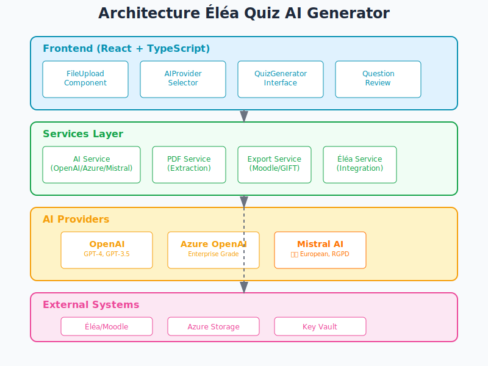
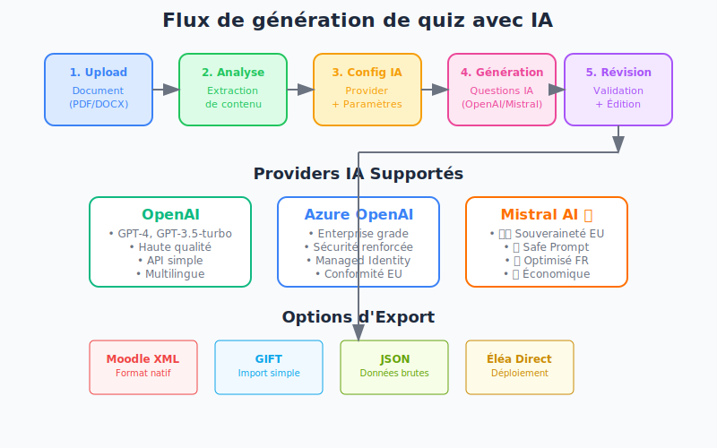
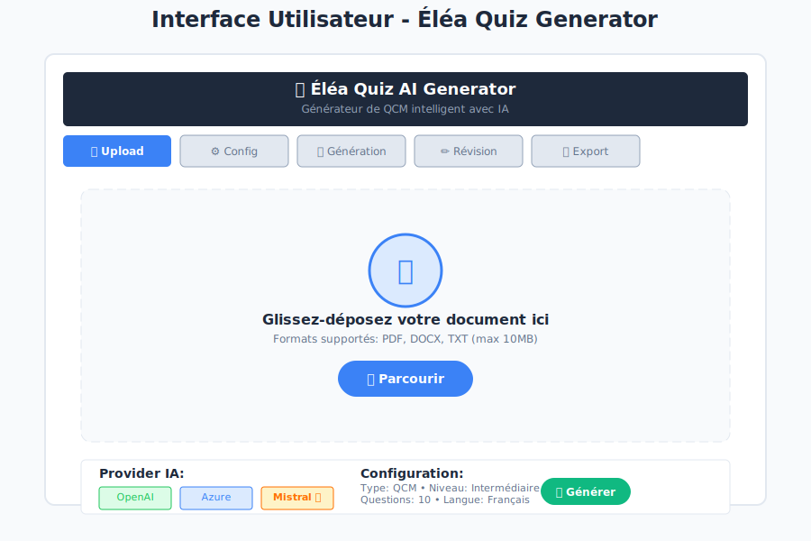
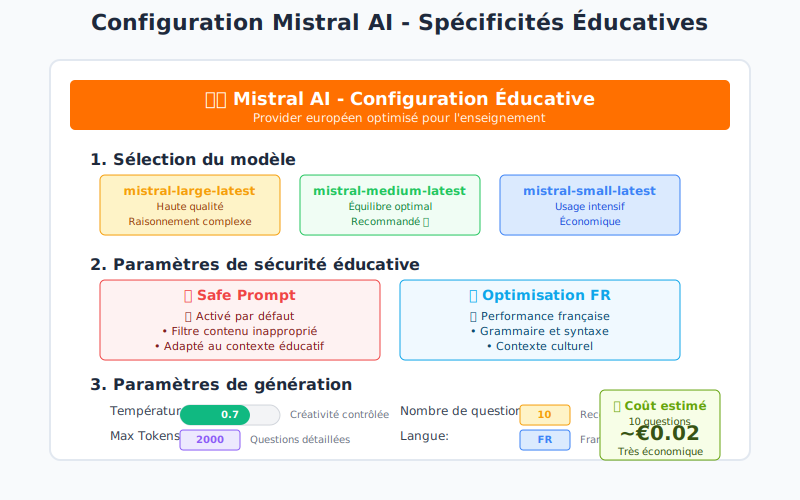

# 📚 Documentation Complète - Éléa Quiz AI Generator

[](https://opensource.org/licenses/MIT)
[](https://www.typescriptlang.org/)
[](https://mistral.ai/)

> Documentation complète du générateur de QCM intelligent pour Éléa/Moodle avec intégration Mistral AI

## 📖 Table des Matières

- [🏗️ Architecture du Système](#️-architecture-du-système)
- [🔄 Flux de Génération](#-flux-de-génération)
- [🤖 Providers IA](#-providers-ia)
- [🎨 Interface Utilisateur](#-interface-utilisateur)
- [⚙️ Configuration Mistral AI](#️-configuration-mistral-ai)
- [🚀 Guide d'Installation](#-guide-dinstallation)
- [📋 Guide d'Utilisation](#-guide-dutilisation)
- [🔧 API Reference](#-api-reference)
- [📊 Screenshots](#-screenshots)

## 🏗️ Architecture du Système



### Composants Principaux

#### Frontend Layer (React + TypeScript)
- **FileUpload Component** : Interface de téléchargement de documents
- **AIProviderSelector** : Sélection et configuration des providers IA
- **QuizGenerator Interface** : Interface principale de génération
- **QuestionReview** : Révision et édition des questions générées

#### Services Layer
- **AI Service** : Gestion des appels aux différents providers (OpenAI, Azure, Mistral)
- **PDF Service** : Extraction et analyse du contenu des documents
- **Export Service** : Export vers différents formats (Moodle, GIFT, JSON)
- **Éléa Service** : Intégration directe avec la plateforme Éléa

#### AI Providers
- **OpenAI** : GPT-4, GPT-3.5-turbo - Performance élevée
- **Azure OpenAI** : Version enterprise avec sécurité renforcée
- **Mistral AI** 🌟 : Provider européen optimisé pour l'éducation

#### External Systems
- **Éléa/Moodle** : Plateforme LMS de déploiement
- **Azure Storage** : Stockage des documents et quiz
- **Key Vault** : Gestion sécurisée des clés API

## 🔄 Flux de Génération



### Étapes du Processus

1. **📁 Upload** : Téléchargement du document source (PDF, DOCX, TXT)
2. **🔍 Analyse** : Extraction automatique du contenu et segmentation
3. **⚙️ Configuration IA** : Sélection du provider et paramétrage
4. **🧠 Génération** : Création des questions via l'IA sélectionnée
5. **✏️ Révision** : Validation et édition manuelle des questions
6. **📤 Export** : Déploiement vers Éléa ou export de fichiers

### Formats d'Export Supportés

- **Moodle XML** : Format natif pour import direct
- **GIFT** : Format texte simple pour import rapide
- **JSON** : Données structurées pour traitement personnalisé
- **Éléa Direct** : Déploiement automatique via API

## 🤖 Providers IA


### Comparaison Détaillée

| Critère | OpenAI | Azure OpenAI | Mistral AI |
|---------|---------|---------------|------------|
| **Performance** | ⭐⭐⭐⭐⭐ | ⭐⭐⭐⭐⭐ | ⭐⭐⭐⭐ |
| **Coût** | 💰💰💰 | 💰💰💰💰 | 💰💰 |
| **Sécurité** | 🔒🔒🔒 | 🔒🔒🔒🔒🔒 | 🔒🔒🔒🔒 |
| **Conformité EU** | 🇺🇸 Limitée | 🇪🇺 Partielle | 🇪🇺 Complète |
| **Support FR** | 🇫🇷 Bon | 🇫🇷 Bon | 🇫🇷 Excellent |

### Recommandations par Contexte

#### 🎓 Éducation → **Mistral AI**
- Safe Prompt pour contenu approprié
- Optimisation française exceptionnelle
- Conformité RGPD native
- Coût économique pour usage intensif

#### 🏢 Entreprise → **Azure OpenAI**
- Sécurité enterprise-grade
- Managed Identity
- Conformité stricte
- Support Microsoft intégré

#### ⚡ Prototypage → **OpenAI**
- API simple et rapide
- Documentation extensive
- Communauté active
- Démarrage immédiat

## 🎨 Interface Utilisateur



### Fonctionnalités de l'Interface

#### Navigation Intuitive
- **Onglets clairs** : Upload → Config → Génération → Révision → Export
- **Progression visuelle** : Indicateur d'étapes avec statut
- **Actions contextuelles** : Boutons adaptés à chaque étape

#### Zone d'Upload
- **Drag & Drop** : Glisser-déposer de fichiers
- **Formats supportés** : PDF, DOCX, TXT (max 10MB)
- **Prévisualisation** : Aperçu du contenu extrait
- **Validation** : Vérification de format et taille

#### Configuration IA
- **Sélecteur de provider** : OpenAI, Azure, Mistral
- **Paramètres avancés** : Température, tokens, safe prompt
- **Présets éducatifs** : Configurations optimisées
- **Estimation de coût** : Calcul en temps réel

## ⚙️ Configuration Mistral AI



### Spécificités Éducatives

#### 🔒 Safe Prompt (Activé par défaut)
```typescript
const mistralConfig = {
  provider: 'mistral',
  model: 'mistral-large-latest',
  safePrompt: true, // ⚠️ Obligatoire pour l'éducation
  temperature: 0.7,
  maxTokens: 2000
};
```

#### 🎯 Optimisation Française
- **Grammaire native** : Respect des règles françaises
- **Contexte culturel** : Références adaptées
- **Vocabulaire éducatif** : Terminologie pédagogique
- **Nuances linguistiques** : Subtilités françaises

#### 📊 Modèles Recommandés

| Modèle | Usage | Coût/1K tokens | Performance |
|--------|-------|----------------|-------------|
| `mistral-large-latest` | Quiz complexes | ~€0.008 | ⭐⭐⭐⭐⭐ |
| `mistral-medium-latest` | Usage standard | ~€0.005 | ⭐⭐⭐⭐ |
| `mistral-small-latest` | Volume élevé | ~€0.002 | ⭐⭐⭐ |

### Configuration Avancée

```json
{
  "provider": "mistral",
  "apiKey": "YOUR_MISTRAL_API_KEY",
  "model": "mistral-large-latest",
  "temperature": 0.7,
  "maxTokens": 2000,
  "safePrompt": true,
  "defaults": {
    "questionCount": 10,
    "questionType": "mixed",
    "difficulty": "intermediate",
    "language": "fr"
  }
}
```

## 🚀 Guide d'Installation

### Installation Rapide Mistral

```bash
# Clone du projet
git clone https://github.com/votre-org/elea-quiz-ai-generator.git
cd elea-quiz-ai-generator

# Installation automatique Mistral
npm run mistral:install

# Configuration
cp .env.example .env
# Ajouter: MISTRAL_API_KEY=votre-clé

# Démarrage
npm run dev
```

### Installation Manuelle

```bash
# Dépendances
npm install

# Ajout de Mistral AI
npm install @mistralai/mistralai commander

# Configuration TypeScript
npm run build

# Tests
npm run test
```

### Variables d'Environnement

```env
# Mistral AI (Recommandé pour l'éducation)
MISTRAL_API_KEY=your-mistral-api-key
MISTRAL_MODEL=mistral-large-latest

# OpenAI (Alternative)
OPENAI_API_KEY=your-openai-key

# Azure OpenAI (Entreprise)
AZURE_OPENAI_ENDPOINT=https://your-resource.openai.azure.com/
AZURE_OPENAI_API_KEY=your-azure-key
AZURE_OPENAI_DEPLOYMENT_NAME=gpt-4

# Éléa Integration
ELEA_API_URL=https://your-elea-instance.com/api
ELEA_API_KEY=your-elea-api-key
```

## 📋 Guide d'Utilisation

### Utilisation Web (Interface Graphique)

1. **Démarrage du serveur**
   ```bash
   npm run dev
   # Accès: http://localhost:5173
   ```

2. **Upload du document**
   - Glisser-déposer le PDF dans la zone
   - Vérifier l'extraction du contenu
   - Valider la segmentation

3. **Configuration IA**
   - Sélectionner **Mistral AI** (recommandé)
   - Choisir le modèle selon vos besoins
   - Ajuster les paramètres (température, tokens)
   - Activer Safe Prompt pour l'éducation

4. **Paramétrage du quiz**
   - Type de questions (QCM, Vrai/Faux, Mixte)
   - Nombre de questions (5-50)
   - Niveau de difficulté
   - Langue (français recommandé)

5. **Génération et révision**
   - Lancer la génération
   - Réviser les questions proposées
   - Éditer si nécessaire
   - Valider la qualité

6. **Export et déploiement**
   - Choisir le format (Moodle XML, GIFT, JSON)
   - Télécharger ou déployer directement
   - Intégrer dans Éléa/Moodle

### Utilisation CLI (Ligne de Commande)

#### Commandes Mistral

```bash
# Voir les modèles disponibles
npm run mistral:models

# Créer une configuration
npm run mistral:init

# Génération rapide
npm run mistral:generate -- \
  --input cours.pdf \
  --count 15 \
  --type mixed \
  --level intermediate

# Avec paramètres avancés
npm run mistral:generate -- \
  --input document.pdf \
  --model mistral-large-latest \
  --safe-prompt \
  --temperature 0.7 \
  --output quiz-output.json
```

#### Scripts Disponibles

| Commande | Description |
|----------|-------------|
| `mistral:models` | Liste les modèles Mistral disponibles |
| `mistral:init` | Crée un fichier de configuration |
| `mistral:generate` | Génère un quiz depuis un document |
| `mistral:install` | Installation automatique complète |

### API REST

#### Endpoints Principaux

```bash
# Upload et génération
POST /api/generate
Content-Type: multipart/form-data
{
  "file": document.pdf,
  "config": {
    "provider": "mistral",
    "model": "mistral-large-latest",
    "questionCount": 10,
    "questionType": "mixed",
    "difficulty": "intermediate",
    "safePrompt": true
  }
}

# Statut de génération
GET /api/status/{jobId}

# Export du quiz
GET /api/export/{quizId}?format=moodle

# Liste des modèles
GET /api/models/mistral
```

## 🔧 API Reference

### Service IA Mistral

```typescript
import { AIService } from './services/aiService';

// Initialisation
const aiService = new AIService({
  provider: 'mistral',
  apiKey: process.env.MISTRAL_API_KEY!,
  model: 'mistral-large-latest',
  safePrompt: true
});

// Génération de quiz
const quiz = await aiService.generateQuiz(content, {
  questionCount: 10,
  questionType: 'mixed',
  difficulty: 'intermediate',
  language: 'fr'
});

// Validation de la configuration
const isValid = aiService.validateConfig(config);
```

### Configuration TypeScript

```typescript
interface MistralConfig {
  provider: 'mistral';
  apiKey: string;
  model: 'mistral-large-latest' | 'mistral-medium-latest' | 'mistral-small-latest';
  temperature: number; // 0.0 - 1.0
  maxTokens: number;
  safePrompt: boolean; // true recommandé pour l'éducation
}

interface QuizGenerationOptions {
  questionCount: number; // 1-100
  questionType: 'mcq' | 'true-false' | 'short-answer' | 'mixed';
  difficulty: 'beginner' | 'intermediate' | 'advanced';
  language: 'fr' | 'en';
  domain?: string; // Domaine de connaissance
}
```

### Hooks React

```typescript
import { useQuizGenerator } from './hooks/useQuizGenerator';

function QuizComponent() {
  const {
    generateQuiz,
    loading,
    error,
    quiz,
    progress
  } = useQuizGenerator('mistral');

  const handleGenerate = async (file: File) => {
    await generateQuiz(file, {
      questionCount: 10,
      questionType: 'mixed',
      difficulty: 'intermediate'
    });
  };

  return (
    <div>
      {loading && <Progress value={progress} />}
      {error && <ErrorMessage error={error} />}
      {quiz && <QuizDisplay quiz={quiz} />}
    </div>
  );
}
```

## 📊 Screenshots

### Interface Principale

*Interface principale avec sélection du provider IA*

### Upload de Documents

*Zone de téléchargement avec drag & drop*

### Configuration IA

*Panneau de configuration Mistral AI avec paramètres éducatifs*

### Génération de Quiz

*Interface de génération avec suivi en temps réel*

### Révision des Questions

*Outil de révision et d'édition des questions générées*

### Intégration Éléa

*Panneau de déploiement direct vers Éléa/Moodle*

---

## 📞 Support et Contribution

### Documentation Additionnelle
- [Guide d'intégration Mistral](./MISTRAL_INTEGRATION.md)
- [API Mistral](./API_MISTRAL.md)
- [Prompts éducatifs](./PROMPTS_EDUCATION.md)
- [Troubleshooting](./TROUBLESHOOTING.md)

### Support
- 📧 Email: support@elea-quiz-generator.com
- 💬 Discord: [Communauté Éléa](https://discord.gg/elea)
- 📚 Wiki: [Documentation complète](https://wiki.elea-quiz-generator.com)

### Contribution
1. 🍴 Fork le projet
2. 🔀 Créer une branche feature (`git checkout -b feature/mistral-improvement`)
3. 💾 Committer les changements (`git commit -m 'Add Mistral feature'`)
4. 📤 Push la branche (`git push origin feature/mistral-improvement`)
5. 🔄 Ouvrir une Pull Request

---

**© 2024 Éléa Quiz AI Generator - Propulsé par Mistral AI 🇪🇺**
